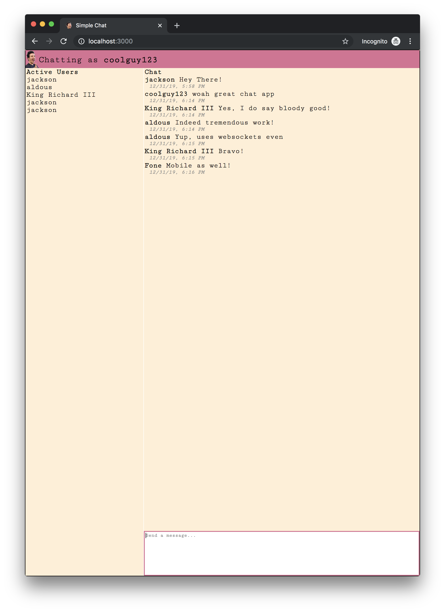
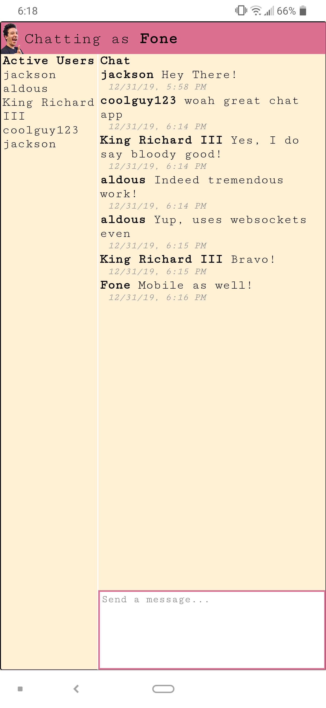

## Simple Chat
This is a very simple chat application using react with socket.io websockets and redux. The backend uses express and Node.js. This was build as a way to experiment with websockets and redux.

<div float="left">
	
	
<div>

### Run the Application
```
npm install
npm start
```

Runs the app in the development mode.<br />
Open [http://localhost:3000](http://localhost:3000) to view it in the browser.

The page will reload if you make edits.<br />
You will also see any lint errors in the console.

The application server will also be run at [http://localhost:4000](http://localhost:4000)

HTTP requests are proxied through the port 3000 dev server, but because of problems I was having with webpack's proxying, the websockets are hardcoded to localhost, instead of being proxied (I know very much not ideal).
